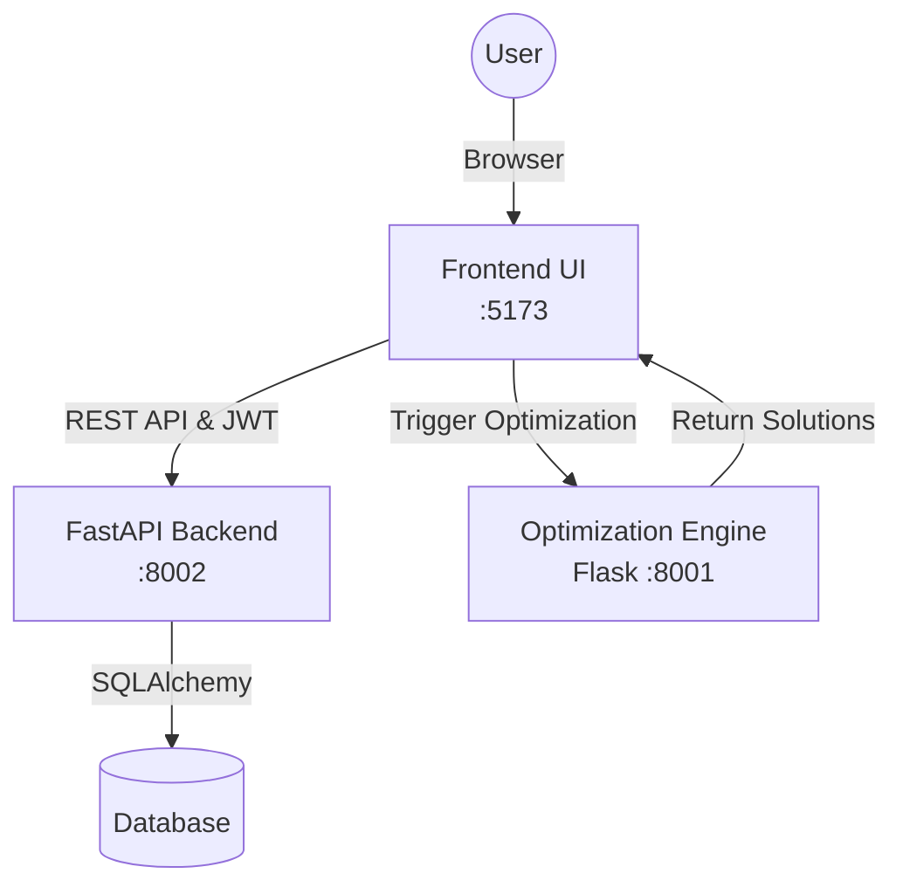

# ✈️ AirCraftPort: Integrated Aircraft Maintenance System

[](LICENSE)
[](https://python.org)
[](https://reactjs.org)
[](https://fastapi.tiangolo.com/)
[](https://flask.palletsprojects.com/)

**AirCraftPort** is an enterprise-grade aircraft maintenance scheduling and optimization system. It seamlessly integrates a modern data management dashboard with heavy computational algorithms to solve complex routing and personnel allocation scenarios in airport operations.

---

## 🏗️ System Architecture

The project consists of three distinct, loosely coupled services:

1. **Frontend Web UI (React/Vite)**
   - Located in: `AirCraft/frontend`
   - Role: User interface for data entry, map visualization, and scheduling oversight.
   - Runs on: `http://localhost:5173`

2. **Core API Backend (FastAPI)**
   - Located in: `AirCraft/backend`
   - Role: Centralized data hub, JWT authentication, RBAC authorization, and persistent storage via SQLite/PostgreSQL (Alembic Migrations).
   - Runs on: `http://localhost:8002`

3. **Optimization Engine (Flask / Google OR-Tools)**
   - Located in: `AirCraft_algo`
   - Role: A dedicated computational server that runs CP-SAT and Hybrid Large Neighborhood Search (LNS) algorithms. Includes a built-in benchmark dashboard.
   - Runs on: `http://localhost:8001`



---

## 🚀 Getting Started

To run the complete system locally, you must start all three services. Ensure you have **Node.js (≥18)** and **Python (≥3.9)** installed.

### Step 1: Start the Core API Backend (FastAPI)

This service manages the database, authentication, and user data.

```bash
# 1. Navigate to the backend directory
cd AirCraft/backend

# 2. Setup the virtual environment
python3 -m venv .venv
source .venv/bin/activate  # Windows: .venv\Scripts\activate

# 3. Install requirements
pip install -r requirements.txt

# 4. Set up Environment Variables
# Create a .env file locally
cat <<EOF > .env
API_HOST=0.0.0.0
API_PORT=8002
JWT_SECRET_KEY=yoursecretkeythatisatleast32characterslong123
REFRESH_SECRET_KEY=yourrefreshsecretkeythatisatleast32chars123
ALLOWED_ORIGINS=http://localhost:5173,http://localhost:3000
DATABASE_URL=sqlite:///./aircraft.db
EOF

# 5. Apply Database Migrations
alembic upgrade head

# 6. Start the Server
uvicorn main:app --env-file .env --reload --port 8002
```
*API Docs available at: [http://localhost:8002/docs](http://localhost:8002/docs)*

### Step 2: Start the Optimization Engine (Flask)

This service handles heavy constraint programming algorithms.

```bash
# 1. Open a new terminal and navigate to the algo directory
cd AirCraft_algo

# 2. Setup the virtual environment
python3 -m venv .venv
source .venv/bin/activate  # Windows: .venv\Scripts\activate

# 3. Install requirements
pip install -r requirements.txt

# 4. Start the Application
python3 main.py
```
*Algorithm Dashboard available at: [http://localhost:8001](http://localhost:8001)*

### Step 3: Start the Frontend UI (React)

```bash
# 1. Open a new terminal and navigate to the frontend directory
cd AirCraft/frontend

# 2. Configure Environment Variables
echo "VITE_API_BASE_URL=http://localhost:8002" > .env

# 3. Install packages
npm install

# 4. Start the Application
npm run dev
```
*Web Application available at: [http://localhost:5173](http://localhost:5173)*

---

## 🎯 Key Capabilities
- **Robust Security**: JSON Web Tokens (JWT) for session management, refresh tokens, and strict Role-Based Access Control (RBAC).
- **Hybrid Solving Approaches**: Leverages Google OR-Tools alongside custom heuristics (LNS, Simulated Annealing, Greedy Topological Sorting).
- **Persistent Data Layers**: Eliminated flat-file JSON mutations in favor of a robust SQLAlchemy workflow.

## 📄 License
This codebase is released under the **MIT License**.
