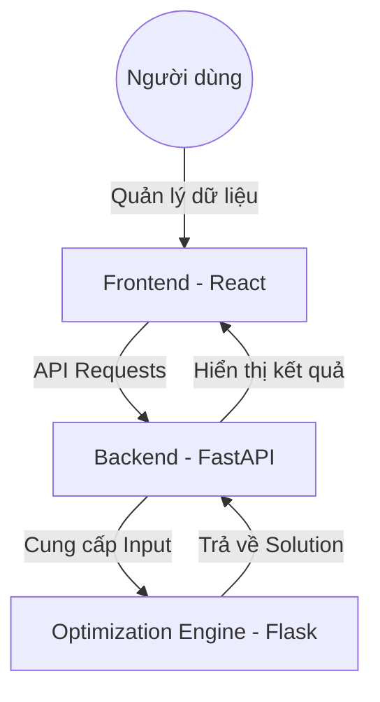

# ✈️ AirCraftPort: Integrated Aircraft Maintenance Scheduling System

[](LICENSE)
[](https://python.org)
[](https://reactjs.org)
[](https://fastapi.tiangolo.com/)
[](https://developers.google.com/optimization)

**AirCraftPort** là một hệ thống quản lý và tối ưu hóa lịch trình bảo trì máy bay toàn diện. Dự án kết hợp giao diện quản lý dữ liệu hiện đại với các thuật toán tối ưu hóa mạnh mẽ để giải quyết các bài toán logistics phức tạp tại sân bay.

---

## 🏗️ Kiến trúc hệ thống

Hệ thống được chia thành hai thành phần chính:

1.  **[AirCraft](./AirCraft)**: Hệ thống quản lý dữ liệu (Data Management System).
    - **Frontend**: React 18, TypeScript, Vite, MUI.
    - **Backend**: FastAPI, Pydantic, Pandas.
2.  **[AirCraft_algo](./AirCraft_algo)**: Công cụ tối ưu hóa (Optimization Engine).
    - **Core**: Google OR-Tools (CP-SAT & MIP).
    - **API**: Flask server để phục vụ các yêu cầu giải bài toán và benchmark.



---

## ✨ Tính năng chính

### 📊 Quản lý dữ liệu (AirCraft)
- **Nhập liệu linh hoạt**: Hỗ trợ tải tệp CSV/Excel, nhập thủ công qua form hoặc trình chỉnh sửa JSON (Monaco Editor).
- **Xác thực thời gian thực**: Kiểm tra tính hợp lệ của dữ liệu ngay khi nhập.
- **Trực quan hóa Bản đồ**: Quản lý tọa độ GPS của các máy bay và trạm dừng qua bản đồ tương tác.
- **Quản lý thực thể**: Máy bay, nhân viên, Hub, tuyến xe bus, và ma trận thời gian/khoảng cách.

### 🧠 Tối ưu hóa lịch trình (AirCraft_algo)
- **Chiến lược giải đa dạng**:
    - **CP-SAT**: Tìm lời giải tối ưu cho các bài toán quy mô nhỏ và vừa.
    - **Hybrid (CP-SAT + MIP)**: Kết hợp gán task và tối ưu thời gian, hiệu quả với dữ liệu lớn.
- **Benchmark Tool**: So sánh hiệu suất giữa các chiến lược và cấu hình khác nhau.
- **Dashboard trực quan**: Xem tiến trình và kết quả giải bài toán qua biểu đồ.

---

## 🚀 Cài đặt nhanh

### Yêu cầu hệ thống
- **Node.js**: 18.0+
- **Python**: 3.9+
- **pip** & **npm**

### Các bước thực hiện

#### 1. Cài đặt Data Management (AirCraft)
```bash
cd AirCraft
# Cài đặt Backend
cd backend && python -m venv .venv && source .venv/bin/activate && pip install -r requirements.txt
# Cài đặt Frontend
cd ../frontend && npm install
```

#### 2. Cài đặt Optimization Engine (AirCraft_algo)
```bash
cd AirCraft_algo
python -m venv .venv && source .venv/bin/activate && pip install -r README.md # Cài đặt theo hướng dẫn trong đó
# Hoặc cài đặt trực tiếp
pip install flask flask-cors ortools
```

#### 3. Khởi chạy toàn bộ hệ thống
Sử dụng các script có sẵn trong `AirCraft`:
```bash
cd AirCraft
./start-all.sh
```
Khởi chạy Solver:
```bash
cd AirCraft_algo
python3 main.py
```

---

## 📁 Cấu trúc thư mục

- `AirCraft/`: Mã nguồn giao diện và backend quản lý dữ liệu.
- `AirCraft_algo/`: Mã nguồn các thuật toán tối ưu hóa và server solver.
- `report/`: Các báo cáo kiểm thử và kiểm toán hệ thống (Audit, UI reports).
- `prompt/`: Tài liệu và hướng dẫn vận hành.

---

## 🧪 Kiểm thử

Dự án tuân thủ quy trình kiểm thử nghiêm ngặt:
- **Backend**: Sử dụng `pytest` cho cả hai module.
- **Frontend**: Kết hợp Unit tests và Integration tests.
- **Tài liệu**: Kiểm tra tính toàn vẹn của liên kết và đường dẫn.

---

## 📄 Giấy phép

Dự án này được cấp phép theo **MIT License**.

---
<p align="center">
  Được xây dựng với ❤️ nhằm tối ưu hóa vận hành sân bay hiện đại.
</p>
