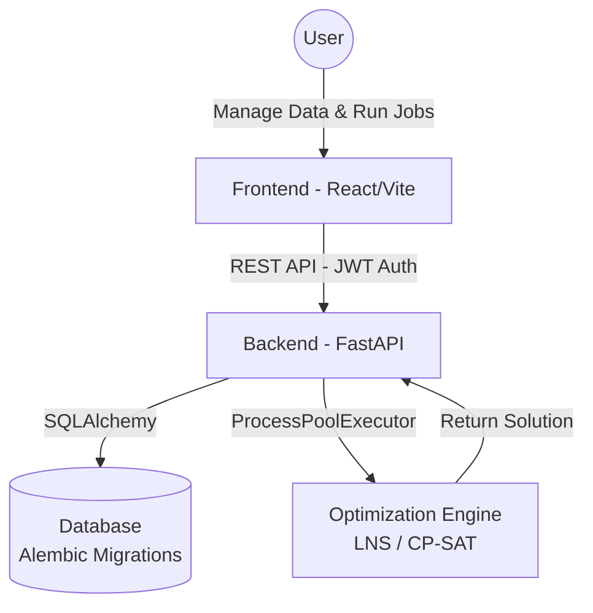

# ✈️ AirCraftPort: Integrated Aircraft Maintenance Scheduling System

[](LICENSE)
[](https://python.org)
[](https://reactjs.org)
[](https://fastapi.tiangolo.com/)
[](https://developers.google.com/optimization)

**AirCraftPort** is a comprehensive aircraft maintenance scheduling and optimization system. It combines a modern data management interface with powerful algorithms to solve complex logistics problems at airports, ensuring timely aircraft turnarounds and efficient staff allocation.

---

## 🏗️ High-level Architecture

Following a recent architecture consolidation, the system operates as a unified stack:

1. **Frontend**: React 18, TypeScript, Vite, MUI. Handles user interactions, data visualization, and input.
2. **Backend**: 100% FastAPI. Provides RESTful APIs, securing operations via JWT & RBAC, and interacting with the database.
3. **Database**: SQLAlchemy ORM with Alembic migrations. Uses SQLite locally (PostgreSQL-ready for production).
4. **Optimization Engine**: Integrated directly into the backend. Uses Google OR-Tools (CP-SAT) and Hybrid LNS, running asynchronously via `ProcessPoolExecutor` for CPU-bound tasks without blocking the API.



---

## ✨ Key Features

- **Robust Security**: JWT authentication with refresh tokens, Role-Based Access Control (Admin, Operator, Viewer), configurable CORS, and rate limiting.
- **Data Persistence**: Managed through SQLAlchemy models and Alembic database migrations.
- **Advanced Scheduling Engine**: Hybrid Large Neighborhood Search (LNS) combined with Simulated Annealing and a fallback Greedy strategy. Handles pairwise travel times, dependency precedence, and break times avoidance.
- **Asynchronous Execution**: Scheduler runs in background workers without blocking the API.
- **Interactive UI**: Upload data, view results, and manage aircrafts/employees globally.

---

## 🚀 Getting Started

### System Requirements
- **Node.js**: 18.0+
- **Python**: 3.9+
- **pip** & **npm**

### 1. Environment Variables Setup

Create `.env` files based on the provided examples. 

**Backend `.env`:**
```env
# Backend & Security
API_HOST=0.0.0.0
API_PORT=8002
JWT_SECRET_KEY=your-super-strong-secret-key-at-least-32-chars
JWT_REFRESH_SECRET_KEY=your-super-strong-refresh-secret-key
ALLOWED_ORIGINS=http://localhost:5173,http://localhost:3000

# Database
DATABASE_URL=sqlite:///./aircraft.db
```

### 2. Backend Setup & Database Migration

```bash
cd AirCraft/backend

# Create and activate virtual environment
python -m venv .venv
source .venv/bin/activate  # Or .\venv\Scripts\activate on Windows

# Install dependencies
pip install -r requirements.txt

# Run database migrations
alembic upgrade head

# Start the FastAPI server
uvicorn main:app --reload --port 8002
```

### 3. Frontend Setup

```bash
cd AirCraft/frontend

# Install packages
npm install

# Start the development server
npm run dev
```

---

## 📁 Root Directory Structure

- `AirCraft/`: Contains the consolidated system.
  - `backend/`: FastAPI application, Alembic configuration, and API endpoints. 
  - `frontend/`: React application, Vite config, and UI components.
- `AirCraft_algo/`: The core optimization engine algorithms, constraints, and solver strategies (imported and used by the backend).
- `report/`: Audit and verification reports.
- `prompt/`: Operational documentation and guides.

---

## 🧪 Testing

The project uses `pytest` for robust quality assurance:
- **Backend Tests**: Coverage for API flows, authentication, and scheduler processing.
- **Algorithm Tests**: Comprehensive validation of CP-SAT constraints, travel times, and solver logic.

```bash
# Run tests
pytest tests/
```

---

## 📄 License

This project is licensed under the **MIT License**.
